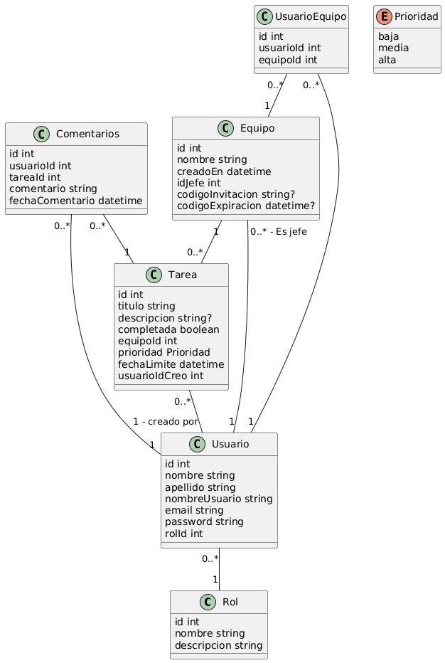

# collaborative-tasks-managment

Link deploy:
- Google Cloud Run: https://mi-app-155019853593.us-central1.run.app
- Vercel: https://collaborative-tasks-managment-k5os.vercel.app/

Cosas a hacer:
- [x] Agregar opción para el creador del equipo de ver la lista de usuarios unidos a su equipo.
- [x] Dar la posibilidad al creador del equipo de eliminar usuarios de su equipo.
- [x] Crear opción de editar tarea (fecha, nombre, prioridad, etc.).
- [x] Crear opción de editar el nombre del equipo.
- [X] Al clickear "Eliminar tarea", "Eliminar equipo", o "Eliminar usuario", que aparezca primero una aviso (doble confirmación).
- [] Hacerlo más responsive.
- [] Agregar la opción de comentar un comentario.
- [] Agregar lógica para que el link de invitación de unión a un equipo solo dure un tiempo.

Modelo BD:

